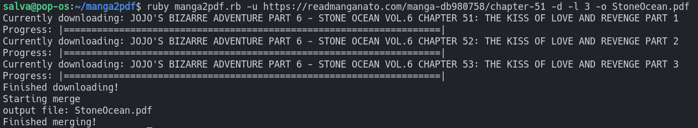
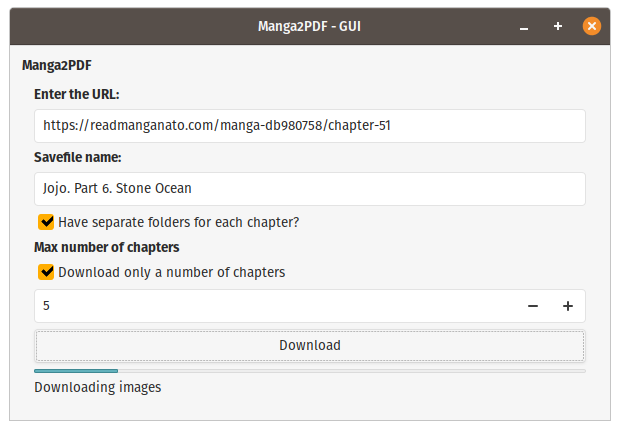

# manga2pdf
Simple script to download and merge manga images into a single pdf file. 

Uses Ruby and Selenium.

Works with manga from Manganato. *Eg: https://readmanganato.com/manga-kb961736/chapter-1.2*


### Requirements
* Ruby 2.7
* make
* ImageMagick and libmagickwand-dev
* firefox-geckodriver
* The gems in the Gemfile

You may get a "security policy" ImageMagick error. In this case add to `etc/ImageMagick-6/policy.xml` the following line just before `</policymap>`:
```
<policy domain="coder" rights="read | write" pattern="PDF" />
```
### Usage
#### CLI Version
Launch the script like this:
```bash
ruby manga2pdf.rb -u <url> [-d] [-l 10] -o name
```
* -u is for the url 
* -d is to create individual directories for each volume.
* -l is to limit the number of chapters downloaded. The number after -l is the number of chapters to download.
* -o provides the output filename. By default is "manga.pdf"
##### GUI Version
Just run
```bash
ruby manga2pdf-gui.rb
```
And follow the GUI.

### Screenshots
#### CLI




#### GUI



